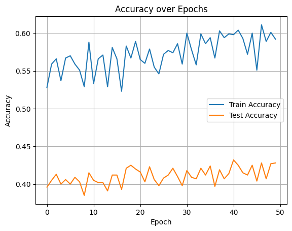
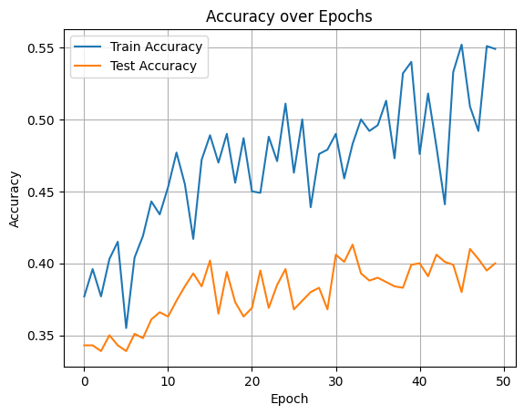
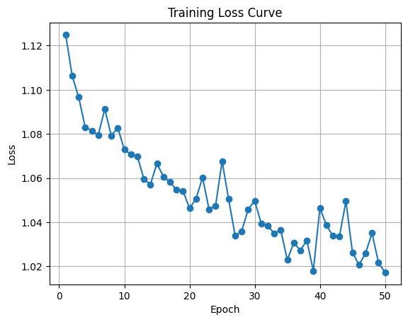
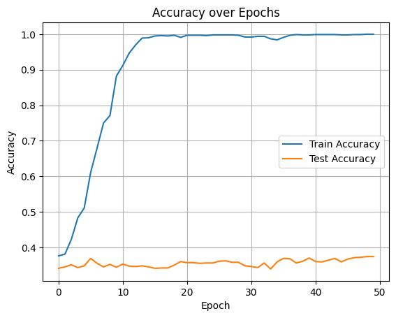
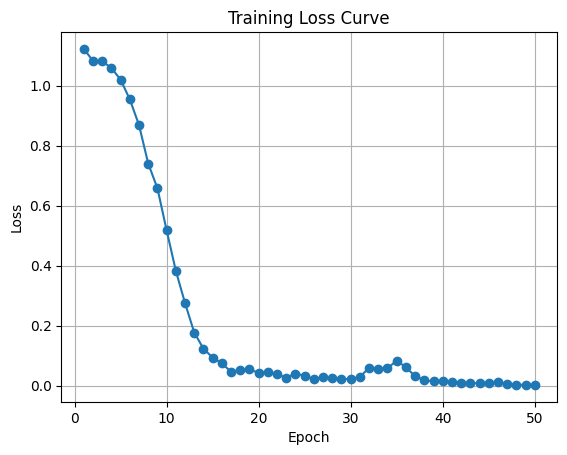

### Q1) 어떤 task를 선택하셨나요?

Multi-genre natural language inference(MNLI)
MNLI는 두 문장이 주어졌을 때 논리적으로 연결이 되어 있는지, 서로 모순되는지, 아니면 아예 무관한지 분류하는 문제다.

### Q2) 모델은 어떻게 설계하셨나요? 설계한 모델의 입력과 출력 형태가 어떻게 되나요?

**DistillBert**와 **BERT-base**를 사용했다.
둘 다 BERT 계열 모델이고 DistillBert가 더 빠르고 가볍지만 원래 BERT 모델과 얼마나 차이 나는 지 테스트했다.
**MNLI 데이터 셋의 구성요소**
*   premise (전제)
*   hypothesis (가설)
* labels 
✅ label의 종류
* **함의(Entailment)**: 전제가 가설을 지 지하는 경우.​ -> 0
* **중립(Neutral)**: 전제가 가설에 대해 중립적이거나 관련이 없는 경우. -> 1
* **모순(Contradiction)**: 전제가 가설과 모순되는 경우.​ -> 2
**데이터 전처리**
1. 데이터 파일(csv)을 불러온 후, 각 row의 premise와 hypothesis가 빈 값인지 아닌지 체크를 한다.
2. 각 row의 premise, hypothesis, label를 추출해서 아래와 같은 형태로 가공
```
{'premise': 'Conceptually cream skimming has two basic dimensions - product and geography.',
  'hypothesis': 'Product and geography are what make cream skimming work. ',
  'label': 1}
```
**batch 데이터 만들기** (collate_fn)
* 각 row에서 label을 추출해서 label 리스트에 넣어주고, premise와 hypothesis는 하나로 합쳐서 texts 리스트에 넣어주었다. 
**TextClassifier 클래스 정의**
* 분류할 클래스가 총 3개임으로 요소가 3개인 벡터를 출력하도록 한다.
```
self.classifier = nn.Linear(768, 3)
```

## Q3) 실제로 pre-trained 모델을 fine-tuning했을 때 loss curve은 어떻게 그려지나요? 그리고 pre-train 하지 않은 Transformer를 학습했을 때와 어떤 차이가 있나요? 

* DistllBert의 정확도 비교
* 

Bert-base의 정확도 비교와 loss 커브

* 
* 

distilBert와 크게 차이가 나지 않는다. 오히려 distilBert 쪽이 더 학습이 잘 된 것 같다.

사전학습하지 않은 트랜스포머의 정확도와 loss 커브



